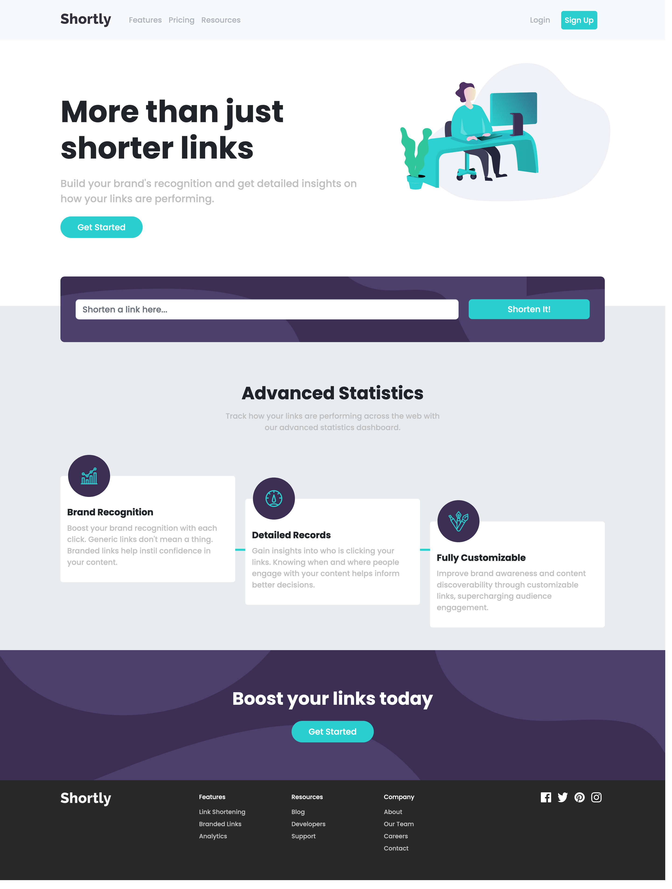

# Shortly URL Landing Page

This is a solution to the [Shortly URL shortening API Challenge challenge on Frontend Mentor](https://www.frontendmentor.io/challenges/url-shortening-api-landing-page-2ce3ob-G).

## Overview

The challenge was to build out a landing page, integrate with the [shrtcode API](https://app.shrtco.de/) and get it looking as close to the original design as possible.


Users should be able to:

- View the optimal layout for the site depending on their device's screen size
- Shorten any valid URL
- See a list of their shortened links, even after refreshing the browser
- Copy the shortened link to their clipboard in a single click
- Receive an error message when the `form` is submitted if:
  - The `input` field is empty

### Screenshot



- Live Site URL: [https://atmkcmo.github.io/FM-shortly-URL/](https://atmkcmo.github.io/FM-shortly-URL/)


### Built with

- Sass
- Bootstap 5
- Axios
- Parcel
- Flexbox


### Project Setup

```sh
npm install
```

### Compile and Hot-Reload for Development

```sh
npm start
```

### Compile and Minify for Production

```sh
npx parcel build
```


## Author

- LinkedIn - [Adam McKee](https://www.linkedin.com/in/admckee/)
